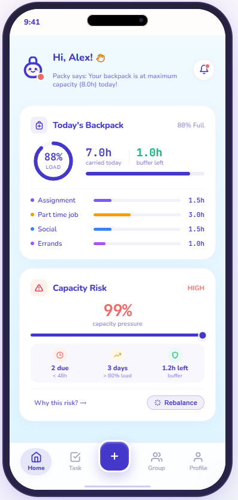
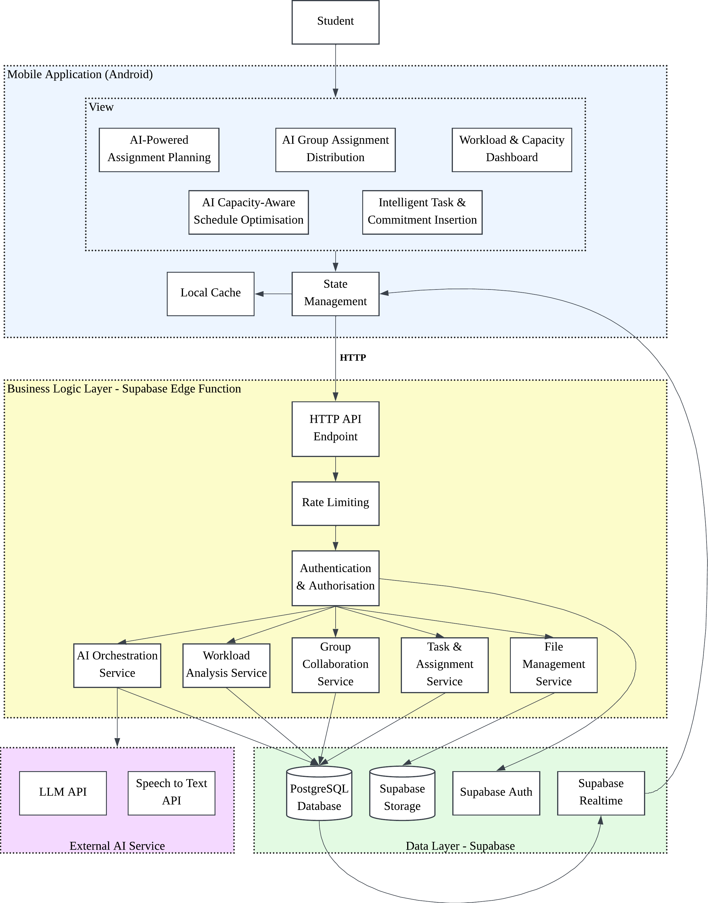

# X-Sload by Xiao16

- **Team Members:** Lum Siew Feng, Lum Shu Ying
- **Problem Statement:** Stress & Workload Manager
- **Video Presentation:** https://youtu.be/IXeF38os7f8
- **Presentation Slides:** https://canva.link/ylovme5uvsnsd09

---

## 1. Project Overview

### 1.1 Problem Statement

University students frequently manage multiple competing commitments, including individual coursework, group assignments, part-time jobs, social activities, and personal responsibilities. Because traditional tools treat scheduling merely as filling empty calendar blocks, students often fail to recognise their actual accumulated workload until their schedule has already become unsustainable. This leads to severe academic stress, fatigue, and last-minute panic, as documented by [Barbayannis et al. (2022)](https://pmc.ncbi.nlm.nih.gov/articles/PMC9169886/).

Existing productivity apps do not differentiate between **available calendar time** and **sustainable cognitive/physical capacity**, nor do they reduce the heavy friction of decomposing complex assignment briefs into actionable workloads. There is an urgent need for an AI-assisted, capacity-aware system that translates academic requirements into structured tasks, evaluates workload pressure before new commitments are accepted, and provides user-controlled rebalancing and guilt-free recovery.

### 1.2 Stakeholders

- **Primary Stakeholders – University Students:**
  Undergraduate and postgraduate students who need to visualise, balance, and maintain a sustainable total workload across academic, employment, extracurricular, and personal commitments without suffering from overcommitment.
- **Secondary Stakeholders – University Project Teams & Peers:**
  Student project groups that need transparent visibility into assignment task distribution, ensuring fair division of labour based on task complexity while respecting each member's individual capacity.

### 1.3 Competitor Analysis

| Competitor        | Feature List                                                                                                                                                                              | Advantages                                                                                                                         | Disadvantages / Limitations                                                                                                                                                                                                                                                         |
| :---------------- | :---------------------------------------------------------------------------------------------------------------------------------------------------------------------------------------- | :--------------------------------------------------------------------------------------------------------------------------------- | :---------------------------------------------------------------------------------------------------------------------------------------------------------------------------------------------------------------------------------------------------------------------------------- |
| **Todoist**       | • Task & project management • Subtasks & recurring dates • Priorities & labels • Calendar & Kanban board views • Collaboration & task delegation • Basic AI task assistant | • Simple, intuitive UI • Strong task capture and organisation • Cross-platform ecosystem • Reliable synchronization       | • Pure task-list focus; treats all hours equally • Does not calculate personal capacity limits • No assignment brief decomposition pipeline • Lacks workload-based burnout risk indicators                                                                                 |
| **TickTick**      | • Task & list management • Calendar view & timeline • Pomodoro timer & habit tracker • Eisenhower Matrix • Statistics & historical reports                                    | • All-in-one productivity suite • Rich time-management utilities • Habit tracking & built-in timers                          | • Focuses on squeezing maximum productivity into time slots • No concept of cognitive capacity vs. free time • Streaks create guilt when tasks are missed • No academic document ingestion or group fairness engine                                                        |
| **Zoho Projects** | • Enterprise project & task management • Gantt charts & milestone tracking • Resource utilisation & workload charts • Time logging & issue tracking                              | • Powerful resource allocation charts • Comprehensive team workload views • Advanced dependency tracking                     | • Built for corporate environments and billable hours • Ignores non-work life commitments (social, personal, part-time jobs) • Heavy administrative overhead; not student-friendly • No automated AI assignment breakdown                                                  |
| **Reclaim.ai**    | • AI calendar scheduling • Smart habit & focus time protection • Dynamic auto-rescheduling • Buffer times & meeting links • Workload and time analytics                       | • Excellent automated calendar packing • Dynamically moves tasks around meetings • Defends personal habits and break buffers | • Calendar-centric: optimizes _when_ to fit work, not _whether_ the total volume is sustainable • Does not analyse academic assignment rubrics/briefs • No academic group work distribution or fairness metrics • Lacks commitment impact simulation ("Should I Say Yes?") |

### 1.4 Our Solution

Our solution is an **AI-assisted student workload and capacity management mobile application** that bridges the gap between academic requirements and sustainable student capacity. Instead of attempting to maximize output or pack every minute of the day, the system evaluates personal capacity, decomposes complex assignments, simulates commitment impacts, balances group responsibilities, and provides user-controlled rebalancing and guilt-free recovery.

#### System Features:

| Feature                                        | Description                                                                                                                                                                                                                                                                                                                                                                                                                                                                                                                                                                                                                                |
| :--------------------------------------------- | :----------------------------------------------------------------------------------------------------------------------------------------------------------------------------------------------------------------------------------------------------------------------------------------------------------------------------------------------------------------------------------------------------------------------------------------------------------------------------------------------------------------------------------------------------------------------------------------------------------------------------------------- |
| **📄 AI-Powered Assignment Planning**          | • Ingests assignment briefs, rubrics, and prompts (PDF/DOCX). • LLM decomposes large deliverables into manageable subtasks (~1 hour granularity). • Generates initial dependencies, estimated durations, and milestone plans. • Full student agency: edit, delete, add, or reprioritise tasks before saving.                                                                                                                                                                                                                                                                                                                      |
| **👥 AI Group Assignment Distribution**        | • Supports group assignment creation and peer collaboration. • Recommends fair task distribution based on task complexity, duration, and dependencies. • **Academic Timetable Clash Prevention:** Checks user-uploaded academic timetables to automatically avoid assigning or scheduling tasks during lectures, tutorials, and lab slots. • Clearly distinguishes **Assignment Fairness** (group balance) from **Personal Capacity** (current user load). • Provides transparent rebalancing suggestions with student-in-the-loop override.                                                                                   |
| **🎯 Intelligent Task & Commitment Insertion** | • Rapid task entry via voice (Speech-to-Text) or manual form input. • **Before/After Impact Preview ("Should I Say Yes?"):** Computes immediate capacity delta before committing. • Flags potential bottleneck days, deadline risks, and schedule consequences. • Suggests actionable choices: _Accept_, _Accept with Modified Duration_, or _Reschedule_.                                                                                                                                                                                                                                                                        |
| **📊 Workload & Capacity Dashboard**           | • **Whole-Life Workload Visualisation:** Aggregates coursework, part-time jobs, social, and personal tasks. • **Workload %:** Measures how much of the available capacity is being consumed. • **Capacity Risk Indicator:** Evaluates how risky the workload situation is after considering deadline pressure, consecutive high-load days, task carryover, and capacity exceedance. Displayed as **High (80–100%)**, **Medium (51–80%)**, and **Low (0–50%)**. • Visualises high-load days and impending bottlenecks without medical or diagnostic claims.                                                                        |
| **📅 AI Capacity-Aware Schedule Optimisation** | • Generates realistic, balanced schedules based on capacity limits rather than calendar packing. • **Timetable & Energy-Aware Scheduling:** Cross-references uploaded academic timetables to ensure tasks are never assigned during scheduled classes, while matching high-difficulty tasks to user-defined peak-energy windows and light tasks to low-energy periods. • **Intelligent Missed-Task Recovery:** Automatically detects uncompleted tasks and recalculates guilt-free recovery slots without stressful overdue alerts. • Never makes silent or destructive calendar edits; all adjustments require student approval. |
| **🔔 Smart Supportive Notifications**          | • Generates actionable, non-punitive reminders for upcoming milestones and recovery breaks. • Early warnings when upcoming consecutive days exceed sustainable capacity thresholds. • Device-local notifications to ensure privacy, zero latency, and minimal infrastructure overhead.                                                                                                                                                                                                                                                                                                                                               |

### 1.5 Detailed Functional Specifications & Workflow Mechanics

To understand how X-Sload operates under the hood, the system combines transparent deterministic mathematical models with server-orchestrated LLM intelligence. Below is the detailed functional breakdown of each core module:

---

#### 1.5.1 AI-Powered Assignment Ingestion & Decomposition Pipeline
- **Purpose:** Converts large, unstructured academic assignment briefs and rubrics into structured, manageable micro-tasks.
- **Workflow & Processing Pipeline:**
  1. **Document Ingestion:** The student uploads an assignment file (`PDF`, `DOCX`, or plain text prompt) through the Flutter client to Supabase Storage.
  2. **Server-Side Extraction & Prompt Orchestration:** A Supabase Edge Function extracts text content and passes it with a structured system prompt to an LLM via OpenRouter.
  3. **Atomic Decomposition:** The model parses key deliverables, grading criteria, and deadlines, decomposing the assignment into granular subtasks calibrated to **~1-hour atomic units**.
  4. **Attribute Tagging:** Each generated task is enriched with:
     - `title` & `description`: Clear actionable instructions.
     - `estimated_duration`: Calibrated duration in hours ($\approx 1.0\text{ hour}$).
     - `difficulty_rating` ($k_{\text{diff}} \in [1, 5]$): Complexity score for cognitive load modeling.
     - `milestone_dependency`: Logical sequencing (e.g., *Research $\to$ Draft $\to$ Revise $\to$ Submit*).
  5. **Human-in-the-Loop Review:** The Flutter client presents an interactive preview modal where students retain full agency to add, edit, delete, reorder, or adjust durations before saving to the database.

---

#### 1.5.2 Whole-Life Capacity & Workload Mathematical Model
- **Purpose:** Quantifies daily cognitive capacity, workload saturation, and burnout risk using transparent, explainable formulas rather than opaque "black-box" scores or medical claims.
- **Formulas & Mathematical Logic:**
  1. **Available Focus Capacity ($C_{\text{avail}}$):**
     $$C_{\text{avail}}(d) = C_{\text{base}} - \sum_{i \in \text{Commitments}(d)} T_i$$
     - **Initial Baseline ($C_{\text{base}}$):** Initially self-identified and set by the student during onboarding based on their perceived daily sustainable focus ceiling (e.g., 6.0–8.0 hours).
     - **Longitudinal AI Calibration:** After several weeks or months of usage, the AI analyzes historical task completion velocity, carryover frequencies, and fatigue patterns to propose an empirically calibrated, realistic capacity value tailored to the student's actual pace (with user confirmation).
     - **Fixed Commitments ($\sum T_i$):** Non-negotiable time blocks including university lectures, tutorial/lab slots, part-time job shifts, and scheduled routines.
  2. **Workload Percentage ($W_{\text{pct}}$):**
     $$W_{\text{pct}}(d) = \left( \frac{\sum_{j \in \text{Tasks}(d)} T_j}{C_{\text{avail}}(d)} \right) \times 100$$
     *Measures the proportion of available capacity consumed by planned tasks on day $d$.*
  3. **Capacity Risk Indicator ($R_{\text{capacity}}$):**
     A composite multi-factor risk index (0–100%) computed from four key operational factors:
     $$R_{\text{capacity}} = w_1 \cdot f_{\text{deadline}} + w_2 \cdot f_{\text{consecutive}} + w_3 \cdot f_{\text{carryover}} + w_4 \cdot f_{\text{exceedance}}$$
     - **Deadline Pressure ($f_{\text{deadline}}$):** Evaluates density and weight of deliverables due within the next $48 - 72$ hours.
     - **Consecutive High-Load Days ($f_{\text{consecutive}}$):** Penalizes unbroken stretches ($\ge 3$ days) where $W_{\text{pct}} > 85\%$.
     - **Task Carryover ($f_{\text{carryover}}$):** Accounts for delayed or overdue tasks rolling over into subsequent days.
     - **Capacity Exceedance ($f_{\text{exceedance}}$):** Activates when daily planned hours exceed 100% of available capacity ($W_{\text{pct}} > 100\%$).
  4. **Risk Classification Thresholds:**
     - 🟢 **Low Risk (0–50%):** Balanced workload with healthy buffer for unforeseen interruptions.
     - 🟡 **Medium Risk (51–80%):** Heavy but manageable load; caution advised before accepting new tasks.
     - 🔴 **High Risk (81–100%):** Critical overload hazard; triggers proactive rebalancing suggestions.

---

#### 1.5.3 Intelligent Task & Commitment Insertion ("Should I Say Yes?" Impact Simulation)
- **Purpose:** Prevents accidental overcommitment by instantly showing students the ripple effect of taking on new tasks before they commit.
- **Workflow & Decision Matrix:**
  1. **Multimodal Task Entry:** Students input tasks via Speech-to-Text (STT voice capture) or manual form entry.
  2. **Automated Parsing:** Extracts task title, due date, duration, category (Academic, Work, Personal, Social), and difficulty.
  3. **Real-Time Delta Simulation:**
     $$\Delta W = W_{\text{projected}} - W_{\text{current}}$$
     Calculates projected workload across target and surrounding days without modifying the active database schedule.
  4. **Actionable Decision Options:**
     - **Option A — Accept:** Displayed when projected load remains safe ($W_{\text{projected}} \le 80\%$).
     - **Option B — Accept with Modified Duration:** Suggests reducing task duration or scoping down to fit within remaining daily capacity.
     - **Option C — Reschedule / Shift:** Recommends alternative upcoming days with low workload to preserve healthy buffers.

---

#### 1.5.4 AI Group Assignment Distribution & Timetable Clash Avoidance
- **Purpose:** Resolves group work coordination friction and prevents unfair workload division while respecting peer personal capacity.
- **Workflow & Algorithmic Logic:**
  1. **Complexity-Weighted Workload Equalization:**
     $$\text{Effort}(T) = \text{Duration}(T) \times k_{\text{diff}}(T)$$
     The balancing engine distributes assignment milestones to minimize variance across member effort allocations:
     $$\min \sum_{m \in \text{Members}} \left( \text{Effort}_m - \mu_{\text{effort}} \right)^2$$
     *Where $\mu_{\text{effort}}$ is the mean effort across all group members.*
  2. **Academic Timetable Clash Prevention:** Cross-references uploaded student class schedules (lectures, labs, tutorials) to ensure group tasks and milestone deadlines are never scheduled during conflicting instructional slots.
  3. **Dual-Lens Transparency:**
     - **Assignment Fairness:** Visualizes each member's percentage contribution to the specific group project.
     - **Personal Capacity:** Visualizes each member's overall real-life workload status (including their other individual subjects and external commitments) so teams make empathetic, feasible distribution decisions.

---

#### 1.5.5 AI Capacity-Aware Schedule Optimisation & Guilt-Free Recovery
- **Purpose:** Dynamically adapts schedules when disruptions occur, replacing punitive overdue notices with supportive recovery paths.
- **Workflow & Algorithmic Logic:**
  1. **Energy-Aware Slot Matching:**
     - High-difficulty tasks ($k_{\text{diff}} \ge 4$) are automatically aligned with user-configured peak-energy focus windows (e.g., morning focus blocks).
     - Low-cognitive tasks ($k_{\text{diff}} \le 2$) are routed to lower energy periods.
  2. **Proactive Workload Rebalancing:** When a day exceeds 100% capacity or triggers High Risk, the engine proposes non-destructive forward-shift options into lighter days while protecting fixed project deadlines.
  3. **Guilt-Free Missed-Task Recovery:** Uncompleted tasks are detected without stress-inducing red badges or broken streak penalties; one-tap recovery smoothly redistributes overdue items into available buffer slots.

---

#### 1.5.6 Smart Supportive Notifications
- **Purpose:** Delivers timely, non-punitive nudges to guide sustainable study habits.
- **Delivery Model:**
  - **Local Device Notifications:** Scheduled and triggered entirely on the user's mobile device for zero latency, offline reliability, and enhanced privacy.
  - **Context-Aware Alerts:** Triggers alerts for consecutive high-load streaks, approaching milestone start times, and recommended recovery breaks.

---

### 1.6 References

- [Barbayannis, G. et al. (2022). Academic Stress and Mental Well-Being in College Students: Correlations, Affected Groups, and COVID-19. PMC9169886.](https://pmc.ncbi.nlm.nih.gov/articles/PMC9169886/)
- [Beyond Blue: How to deal with assignment & university anxiety](https://forums.beyondblue.org.au/t5/anxiety/how-to-deal-with-assignment-university-anxiety/td-p/622204)

---

## 2. Ideation and Process

### 2.1 Ideas We Considered

| Idea / Feature                                                          | Why It Was Dropped or Kept                                                                                                                                                                                                                                                                                                                                                                                                                                                                                                                                                                                                                                                                                                                                                                                                                    |
| :---------------------------------------------------------------------- | :-------------------------------------------------------------------------------------------------------------------------------------------------------------------------------------------------------------------------------------------------------------------------------------------------------------------------------------------------------------------------------------------------------------------------------------------------------------------------------------------------------------------------------------------------------------------------------------------------------------------------------------------------------------------------------------------------------------------------------------------------------------------------------------------------------------------------------------------- |
| **AI-Powered Assignment Planning** ✅ **Chosen**                     | **Integrated Ideas:** Assignment & File Upload; AI Task Breakdown; Assignment-to-Workload Pipeline; Estimated Task Duration; Deadline Management.  Chosen because unstructured assignments are the primary cause of academic procrastination and workload miscalculation. Using an LLM to parse briefs into ~1-hour atomic tasks removes manual overhead and feeds directly into the capacity calculation engine.                                                                                                                                                                                                                                                                                                                                                                                                                       |
| **AI Group Assignment Distribution** ✅ **Chosen**                   | **Integrated Ideas:** Group Task Distribution; Academic Group Workload Balancer; Academic Timetable Clash Avoidance; Individual Contribution Tracking; Workload Imbalance Detection; Task Redistribution Suggestions.  Chosen because group coursework introduces significant peer coordination friction and unfair workload division. The system checks each user's uploaded academic timetable to automatically avoid assigning tasks during lectures, tutorials, or lab hours, balancing tasks by complexity, duration, and dependencies while explicitly distinguishing between assignment fairness and personal capacity.                                                                                                                                                                                                          |
| **Intelligent Task & Commitment Insertion** ✅ **Chosen**            | **Integrated Ideas:** Speech-to-Text Task Input; Workload-Aware Task Input; Before/After Workload Preview; “Should I Say Yes?” Simulation.  Chosen because students frequently accept extra shifts or social plans without realising they are crossing their capacity limits. Instant before/after simulation empowers intentional decision-making before overload occurs.                                                                                                                                                                                                                                                                                                                                                                                                                                                              |
| **Workload & Capacity Dashboard** ✅ **Chosen**                      | **Integrated Ideas:** Workload Dashboard; Whole-Life Workload Visualisation; Student Workload Capacity; Workload Score / Percentage; Workload Heatmap; Deadline Density Analysis; Overload Warning; Task Progress Tracking.  Chosen because students need an immediate, single-pane-of-glass view of their total commitments across academic, employment, and personal spheres. The dashboard clearly distinguishes between **Workload %** (how much of the available capacity is being consumed) and the **Capacity Risk Indicator** (how risky the workload situation is after considering deadline pressure, consecutive high-load days, task carryover, and capacity exceedance, displayed as Low 0–50%, Medium 51–80%, High 80–100%). Provides explainable, mathematical workload risk metrics without clinical diagnostic claims. |
| **AI Schedule Optimisation & Rescheduling** ✅ **Chosen**            | **Integrated Ideas:** Smart Workload Planning; AI Load Balancer; AI Rescheduling; Smart Priority Engine; AI Workload Rebalancer; Timetable Conflict Avoidance; Energy-Aware Matching; Missed-Task Recovery.  Chosen because static schedules fail when unexpected disruptions occur. This unified engine checks user-uploaded academic timetables to prevent assigning tasks during class commitments, distributes tasks across available capacity, matches task difficulty to energy rhythms, and provides guilt-free recovery paths when tasks are missed.                                                                                                                                                                                                                                                                            |
| **Smart Notifications** ✅ **Chosen**                                | **Integrated Ideas:** Smart Supportive Notifications; Gentle Nudges; Deadline Reminders; Capacity Warning Alerts; Break Reminders.  Chosen as a lightweight supporting utility using local device notifications. Prompts timely rebalancing and recovery without spamming or inducing guilt.                                                                                                                                                                                                                                                                                                                                                                                                                                                                                                                                            |
| **Manual Stress, Wellbeing & Crisis Monitoring** ❌ **Dropped**      | **Dropped 5 ideas:** Daily Check-in / Stress & Well-being Check-in, Mental Health Check, Stress Level Prediction & Trigger Analysis, Personalised Stress / Wellbeing Recommendations, “I Am Overwhelmed” Panic Button.  Dropped because manual mood/stress tracking increases user friction and veers into clinical psychology/medical diagnosis, which requires formal compliance and sensitive health data handling. Workload pressure is instead derived objectively from workload mathematics.                                                                                                                                                                                                                                                                                                                                      |
| **Retrospective Reporting & Behavioural Analysis** ❌ **Dropped**    | **Dropped 2 ideas:** Weekly Report, Procrastination Pattern Detection.  Dropped because retrospective diagnostics require weeks of historical logging before providing value. The 3-week MVP prioritises proactive planning and immediate forward-looking rebalancing.                                                                                                                                                                                                                                                                                                                                                                                                                                                                                                                                                                  |
| **Overlapping Planning, Scheduling & Recovery Modes** ❌ **Dropped** | **Dropped 7 ideas:** Exam Preparation Planner / Exam Season Mode, “What Should I Do Now?” Button, Semester Planner, Minimum Viable Day Planning, Stress-Aware Calendar / Scheduling, Study Plan Generator, Micro-Break Planner.  Dropped because they introduce redundant planning modes that segment the user experience. All scheduling, capacity matching, and recovery needs are handled holistically within the core Schedule Optimisation Engine. Note that while Micro-Break Planner as a standalone planning mode was dropped, Break Reminders remain as part of Smart Supportive Notifications.                                                                                                                                                                                                                                |
| **External Integrations & Document Parsing** ❌ **Dropped**          | **Dropped 2 ideas:** Syllabus Import / Auto Extraction, Calendar / LMS Integration (Canvas/Moodle/Google Calendar sync).  Dropped due to high integration overhead, OAuth complexity, university firewall constraints, and brittle document scraping. Assignment and academic timetable uploads alongside direct task input provide a reliable, self-contained MVP demonstration.                                                                                                                                                                                                                                                                                                                                                                                                                                                       |
| **Secondary Productivity Utilities & Chatbots** ❌ **Dropped**       | **Dropped 3 ideas:** Pomodoro / Focus Timer, Generic AI Chatbot, Scope Creep Detector.  Dropped because standalone timers and open-ended chatbots distract from the core workload capacity innovation and add conversational latency. Actionable recommendations are embedded directly within structured workflows.                                                                                                                                                                                                                                                                                                                                                                                                                                                                                                                     |
| **Gamification & Engagement Mechanics** ❌ **Dropped**               | **Dropped 7 ideas:** Virtual Pet, Profile Decoration, Coins/Rewards, Healthy Productivity Points, Streaks, Badges, Gamified Sustainable Productivity.  Dropped because artificial gamification (especially streaks) causes anxiety and guilt when broken, directly contradicting the product's recovery-oriented, low-stress philosophy.                                                                                                                                                                                                                                                                                                                                                                                                                                                                                                |
| **Social, Community & Venting Features** ❌ **Dropped**              | **Dropped 6 ideas:** Failure Museum, Peer Support Groups, Parallel Play / Cozy Rooms, Body Doubling Audio Rooms, Ephemeral “Scream into the Void”, Advisor / Counsellor View.  Dropped because community and social feeds require real-time moderation, privacy controls, and extensive backend infrastructure that distract from personal capacity management.                                                                                                                                                                                                                                                                                                                                                                                                                                                                         |
| **General Wellbeing, Mood & Lifestyle Tracking** ❌ **Dropped**      | **Dropped 5 ideas:** Mood Journal, Gratitude / Reflection Prompt, Wellness Challenges, Mood-Based Suggestions, Sleep Tracking.  Dropped because subjective journaling adds cognitive burden and daily logging friction. Sustainable capacity is derived from planned hours, deadlines, and user-set energy preferences.                                                                                                                                                                                                                                                                                                                                                                                                                                                                                                                 |
| **Hardware, Biometrics & External Sensors** ❌ **Dropped**           | **Dropped 3 ideas:** Sleep-hour Detection from Phone Usage, Wearable Integration (Apple Health/Fitbit), Biometric Anti-Doomscroll Interface.  Dropped because hardware dependencies limit accessibility and introduce complex native sensor APIs unnecessary for proving the core workload scheduling concept.                                                                                                                                                                                                                                                                                                                                                                                                                                                                                                                          |
| **Out-of-Scope Life & Career Administration** ❌ **Dropped**         | **Dropped 3 ideas:** Big Sibling AI (Life Admin), Off-Track Career Mapper, Institutional Analytics.  Dropped because career coaching and administrative life tasks expand scope beyond the central university student workload problem.                                                                                                                                                                                                                                                                                                                                                                                                                                                                                                                                                                                                 |

### 2.2 Ideation Board

### 2.3 Mentor Consultation

| Mentor             | Date Time         | Feedback                                                                                                                                                                                                                                                                                                                                                                                                                                                                                                                                                                                                                                                                                                                                                                                                                                                                                                                                                                                                                                                                                                                                                                                                                                                                                                                                                                                                                                                                                                                                                                                                                                                                          | Changes & Implementation                                                                                                                                                                                                                                                                                              |
| :----------------- | :---------------- | :-------------------------------------------------------------------------------------------------------------------------------------------------------------------------------------------------------------------------------------------------------------------------------------------------------------------------------------------------------------------------------------------------------------------------------------------------------------------------------------------------------------------------------------------------------------------------------------------------------------------------------------------------------------------------------------------------------------------------------------------------------------------------------------------------------------------------------------------------------------------------------------------------------------------------------------------------------------------------------------------------------------------------------------------------------------------------------------------------------------------------------------------------------------------------------------------------------------------------------------------------------------------------------------------------------------------------------------------------------------------------------------------------------------------------------------------------------------------------------------------------------------------------------------------------------------------------------------------------------------------------------------------------------------------------------- | :-------------------------------------------------------------------------------------------------------------------------------------------------------------------------------------------------------------------------------------------------------------------------------------------------------------------- |
| **Teng Wei Herr**  | 4 Sep 2026, 16:25 | • **Focus on Depth Rather Than Breadth:** Focus on one specific aspect of student stress and explore the problem more deeply instead of covering too many areas. • **Conduct More Research on Stress:** Conduct further research on student stress to better understand existing methods of managing it. • **Enhance Existing Solutions:** A completely new idea is not necessary. Existing systems can be studied and enhanced by identifying their limitations and adding improvements that provide greater value to users.                                                                                                                                                                                                                                                                                                                                                                                                                                                                                                                                                                                                                                                                                                                                                                                                                                                                                                                                                                                                                                                                                                                                               | • Scoped product strictly to the **Workload & Capacity Management** problem. • Eliminated disparate features (chatbots, life admin, mood journals) to focus 100% on the Assignment-to-Capacity pipeline.                                                                                                           |
| **Kueh Pang Teng** | 5 Sep 2026, 22:15 | • **Pitch Structure & Presentation Strategy:** &nbsp;&nbsp;- Follow rubric closely; emphasize sections with higher scoring weights. &nbsp;&nbsp;- Clearly present problem statement, target users/difficulties, solution, and tech stack. &nbsp;&nbsp;- Cover business/market growth and user acquisition if required. &nbsp;&nbsp;- Create a memorable impression with unique elements. • **Market Research & Competitor Analysis:** &nbsp;&nbsp;- Study existing applications; compare features, strengths, and weaknesses. &nbsp;&nbsp;- Clearly demonstrate what makes the solution distinct and why users would choose it. &nbsp;&nbsp;- Review prior hackathons to learn how similar problems were approached. • **Ideation & Feature Development:** &nbsp;&nbsp;- Ensure features solve real, verified problems rather than bloating functionality. &nbsp;&nbsp;- Emphasize team-driven ideation; use AI as a supporting tool rather than relying on AI prompts for core concepts. &nbsp;&nbsp;- Gamification must be purposeful and tied to real problem-solving rather than trivial points/badges. • **Evidence & Validation:** &nbsp;&nbsp;- Back feature claims with research papers, surveys, or market data. &nbsp;&nbsp;- Maintain explicit linkages between features, user needs, and the main problem statement. • **Hackathon Strategy:** &nbsp;&nbsp;- Prioritize idea refinement and unique selling points. &nbsp;&nbsp;- Concentrate development efforts on high-scoring, high-value MVP features. &nbsp;&nbsp;- Ensure end-to-end consistency across problem, features, tech, prototype, and pitch. | • Dropped all gamification (streaks/coins) and replaced with guilt-free recovery mechanics. • Formulated the core differentiator: **Capacity-Aware Planning vs. Time-Slot Packing**. • Unified feature definitions and removed out-of-scope database tables.                                                    |
| **Looi Wei En**    | 6 Sep 2026, 20:00 | • **Ideation & Problem Scoping:** &nbsp;&nbsp;- List all qualifying ideas and clearly scope included vs. excluded features. &nbsp;&nbsp;- Provide brief, data-backed problem validation without spending excessive time. &nbsp;&nbsp;- Keep problem statements precise; clarify vague terms (e.g., exact inputs/outputs of "AI analysis"). &nbsp;&nbsp;- Maintain strict feature alignment with the central workload/stress problem. • **Feature Selection & Differentiation:** &nbsp;&nbsp;- Unifying existing fragmented tools into an all-in-one workflow serves as a strong differentiator. &nbsp;&nbsp;- Evaluate competitor apps; refine existing concepts instead of chasing novelty for its own sake. &nbsp;&nbsp;- Demote non-essential utilities (e.g., app blockers) to secondary priority. &nbsp;&nbsp;- Specify mechanics in detail (e.g., burnout metrics, task difficulty calculation). &nbsp;&nbsp;- Focus maximum development resources on the core differentiator. • **Execution & Technical Implementation:** &nbsp;&nbsp;- Prioritize a working concept prototype over a complete application. &nbsp;&nbsp;- Filter features by technical feasibility and implementation timeline. • **Pitching & Presentation:** &nbsp;&nbsp;- Craft a crisp 5-minute pitch highlighting key project value. &nbsp;&nbsp;- Scope the demo prototype to features that can be clearly showcased within the time limit. • **Handling Mentor Feedback:** &nbsp;&nbsp;- Critically evaluate advice across mentors; filter recommendations while preserving core project vision.                                              | • Formulated transparent, deterministic mathematical formulas for Workload %, Available Capacity, and Capacity Risk. • Separated LLM usage (text parsing) from deterministic Dart logic (scheduling and math). • Designed UI with explicit _Review → Confirm → Apply_ steps for all AI recommendations. |

---

## 3. Design Prototype

- **Prototype Link / Figma:** https://code-nection2026-git-master-lum-study.vercel.app/

### 3.1 Home & Workload Dashboard

- **Home Page:** Central dashboard displaying daily capacity, workload percentage, upcoming deadlines, and real-time capacity risk status.
- **Why this risk?:** Clicked from the _"Why this risk?"_ indicator on the Home screen to view explainable risk factors (deadline urgency, task carryover, and high-capacity days).
- **Home - Rebalancer:** Clicked from _"Rebalance"_ to access AI-suggested schedule adjustments and non-destructive workload rebalancing.

| Home Page | "Why this risk?" Breakdown | AI Workload Rebalancer |
| :---: | :---: | :---: |
|  |  |  |

---

### 3.2 Task List & Management

- **Multi-View Task Schedule:** Provides flexible Day, Week, and Month views for users to inspect tasks across different time horizons.
- **Task Reschedule:** Allows quick, guilt-free rescheduling when a task is unable to be completed on time.
- **Add New Task:** Streamlined task entry flow for capturing task details, duration, difficulty, and simulating capacity impact.

#### Day, Week & Month Views

| Day View | Week View | Month View |
| :---: | :---: | :---: |
|  |  |  |

#### Reschedule & Add New Task

| Reschedule Missed Task | Add New Task (Step 1) | Add New Task (Step 2) |
| :---: | :---: | :---: |
|  |  |  |

---

### 3.3 Group Project & Assignment

- **Group Project List:** Overview of active group projects, member allocations, and overall completion progress.
- **Project Details:** Detailed assignment breakdown displaying subtasks, dependencies, and individual workload distribution.
- **Reorganise:** AI-powered and user-controlled task redistribution to eliminate workload imbalances and timetable clashes.
- **Add Project:** Assignment brief ingestion and setup flow that parses deliverables into structured milestones and tasks.

#### Group Project List & Details

| Group Project List | Project Details (Overview) | Project Details (Breakdown) |
| :---: | :---: | :---: |
|  |  |  |

#### Project Reorganisation Flow

| Reorganise | Reorganise (Continued) | Reorganise (Continued) |
| :---: | :---: | :---: |
|  |  |  |

#### Add Project Flow

| Add Project - Step 1 | Add Project - Step 2 | Add Project - Step 2 (Continued) |
| :---: | :---: | :---: |
|  |  |  |

---

## 4. What Makes It Different

### 4.1 Unique Value Proposition (UVP)

> **"Traditional calendar and task apps ask how much work can fit into your empty time slots; our system calculates how much workload your personal capacity can sustainably carry, turning overwhelming assignments into manageable steps and helping students recognise unsustainable workload patterns before they become overwhelming."**

### 4.2 Key Product Differentiators

|   #   | Differentiator                                        | Traditional Productivity Apps (Todoist, TickTick, Google Cal)                                         | Our Solution                                                                                                                                                                                                                                                                      |
| :---: | :---------------------------------------------------- | :---------------------------------------------------------------------------------------------------- | :-------------------------------------------------------------------------------------------------------------------------------------------------------------------------------------------------------------------------------------------------------------------------------- |
| **1** | **Personal Workload Capacity Model**                  | Treat all free calendar hours as equal and available for infinite task packing.                       | Distinguishes between **calendar availability and sustainable human capacity**, weighting tasks by cognitive difficulty and deadline urgency.                                                                                                                                     |
| **2** | **Assignment-to-Workload Pipeline**                   | Require students to manually create, estimate, and schedule dozens of individual assignment subtasks. | Automatically parses unstructured assignment briefs/rubrics (PDF/DOCX) into atomic, ~1-hour manageable tasks with suggested dependencies.                                                                                                                                         |
| **3** | **Before/After Impact Preview ("Should I Say Yes?")** | Blindly add tasks to lists without indicating the cumulative impact on future stress or workload.     | Simulates the exact capacity delta **before** a commitment is accepted, providing explainable suggestions (_Accept_, _Accept with Modified Duration_, _Reschedule_).                                                                                                              |
| **4** | **Academic Group Workload Balancer**                  | Simple shared lists or enterprise billable hour trackers that ignore personal member limits.          | Balances academic deliverables based on task complexity, duration, and dependencies while **cross-referencing user-uploaded academic timetables** to prevent task assignment during lecture/tutorial hours and distinguishing **Assignment Fairness** from **Personal Capacity**. |
| **5** | **Whole-Life Workload Visualisation**                 | Siloed project folders that separate study from personal life, hiding cumulative fatigue.             | Combines coursework, part-time jobs, social engagements, and personal commitments into a single unified capacity dashboard.                                                                                                                                                       |
| **6** | **Guilt-Free Recovery & Energy Matching**             | Flash red overdue badges and streak-loss penalties when tasks slip, inducing guilt and anxiety.       | Treats missed tasks constructively with **one-tap adaptive redistribution** and matches difficult tasks to user-defined peak-energy windows.                                                                                                                                      |

---

## 5. Technical Architecture & Feasibility

### 5.1 Tech Stack

| Component                            | Technology                                                     | Purpose / Why Chosen                                                                                                                                                                                                                              |
| :----------------------------------- | :------------------------------------------------------------- | :------------------------------------------------------------------------------------------------------------------------------------------------------------------------------------------------------------------------------------------------ |
| **Mobile Frontend**                  | **Flutter + Dart**                                             | Develop the Android mobile application from a single codebase. Flutter is suitable for the mobile-first scope and supports rapid development of dashboards, forms, task management, and interactive interfaces.                                   |
| **UI / Design**                      | **Flutter Material 3**                                         | Provides reusable mobile UI components for dashboards, cards, forms, navigation, dialogs, and interactive workload visualisations.                                                                                                                |
| **State Management**                 | **Flutter State Management** _(e.g., Riverpod)_                | Manages application state such as tasks, workload information, group activities, authentication status, and real-time updates between screens.                                                                                                    |
| **Local Cache**                      | **Flutter Local Storage** _(e.g., SQLite / SharedPreferences)_ | Stores lightweight local data and temporary application state to reduce unnecessary network requests and improve the responsiveness of the mobile application.                                                                                    |
| **Backend / API**                    | **Supabase Edge Functions**                                    | Provides server-side application logic and HTTP API endpoints without requiring a separate backend server. Used to process requests, enforce business rules, and coordinate application services.                                                 |
| **API Security**                     | **HTTPS + Rate Limiting**                                      | Secures communication between the Flutter application and backend services while limiting excessive API requests and reducing potential API abuse.                                                                                                |
| **Authentication & Authorisation**   | **Supabase Auth**                                              | Handles user registration, login, session management, and authenticated access to application resources.                                                                                                                                          |
| **Database**                         | **Supabase PostgreSQL**                                        | Stores structured application data across core tables: `profiles`, `assignments`, `tasks`, `commitments`, `groups`, `group_members`, and `group_tasks`. PostgreSQL is suitable for relational relationships and complex queries.                  |
| **File Storage**                     | **Supabase Storage**                                           | Stores assignment-related files, uploaded academic timetables, and other user-uploaded resources separately from the relational database.                                                                                                         |
| **Real-time Data**                   | **Supabase Realtime**                                          | Provides real-time updates when database records change, allowing workload, task, and group collaboration changes to be reflected in the mobile application without continuous polling.                                                           |
| **AI Orchestration**                 | **Supabase Edge Functions + OpenRouter (LLM Gateway)**        | Edge Functions act as the secure application layer connecting to AI models via OpenRouter. This keeps AI API credentials away from the mobile client and allows prompt templates, validation, and business rules to be enforced server-side. |
| **AI / Recommendation**              | **LLM API (via OpenRouter)**                                   | Powers AI-based task breakdown, academic timetable clash analysis, workload planning, commitment impact analysis, and personalised workload-management recommendations.                                                                         |
| **Speech-to-Text**                   | **Speech-to-Text API**                                         | Converts spoken task descriptions into text so students can create tasks through voice input. The request can be routed through the AI orchestration layer where appropriate.                                                                     |
| **Charts / Visualisation**           | **Flutter Charting Library** _(e.g., fl_chart)_                | Visualises workload distribution, weekly workload/capacity trends, task progress, and overload reports.                                                                                                                                           |
| **Notifications**                    | **Device / Local Notifications**                               | Triggers reminders and alerts directly on the student's device for deadlines, planned tasks, and workload-related events. For a prototype where notifications are primarily device-triggered, a separate FCM backend is not necessarily required. |
| **Hosting / Backend Infrastructure** | **Supabase Cloud**                                             | Hosts the PostgreSQL database, authentication, storage, real-time services, and Edge Functions, reducing the need to maintain separate backend infrastructure.                                                                                    |
| **Version Control**                  | **Git + GitHub**                                               | Provides source-code version control, backup, branching, and collaboration throughout development.                                                                                                                                                |

### 5.2 Architectural Diagram

### 5.3 Build Plan and Scope

| Week                                                              | Day        | Target Output / Milestone                                                                                                                                                                                                                                                                                                                                                                                                                                                                       |
| :---------------------------------------------------------------- | :--------- | :---------------------------------------------------------------------------------------------------------------------------------------------------------------------------------------------------------------------------------------------------------------------------------------------------------------------------------------------------------------------------------------------------------------------------------------------------------------------------------------------- |
| **Week 1: Core Foundation & Atomic Ingestion Components**         | **Day 1**  | **Core Database Schema & Capacity Models:** Set up the Flutter project (Material 3 + Riverpod) and Supabase database. Implement foundational database tables (`profiles`, `assignments`, `tasks`, `commitments`, `groups`, `group_members`, `group_tasks`) and pure capacity calculation models (daily baseline capacity hours, energy preference configuration).                                                                                                                               |
|                                                                   | **Day 2**  | **Atomic Task & Commitment Input Form:** Build reusable low-level input widgets and the manual task entry form with field validation for task properties (`title`, `due_date`, `duration`, `category`, `difficulty`).                                                                                                                                                                                                                                                                           |
|                                                                   | **Day 3**  | **Voice Audio Capture & Extraction Component:** Implement Speech-to-Text audio capture and an LLM-based entity extraction helper to convert spoken task descriptions into structured task fields.                                                                                                                                                                                                                                                                                               |
|                                                                   | **Day 4**  | **Document Upload & Storage Component:** Build reusable document picker and Supabase Storage attachment handler for assignment files and academic timetables `(PDF/DOCX/Images)`. Support document viewing, replacement, and removal.                                                                                                                                                                                                                                                           |
|                                                                   | **Day 5**  | **AI Assignment Decomposition Engine:** Develop a Supabase Edge Function that extracts relevant text from uploaded assignment documents and uses an LLM API to decompose assignments into granular ~1-hour tasks with duration estimates, difficulty ratings, and initial dependencies.                                                                                                                                                                                                         |
|                                                                   | **Day 6**  | **Task Breakdown Preview & Edit Component:** Build interactive review list widget allowing students to inspect, edit, reorder, add, or remove AI-generated tasks before database confirmation.                                                                                                                                                                                                                                                                                                  |
|                                                                   | **Day 7**  | **AI-Powered Assignment Planning Module Assembly:** Integrate document upload, AI decomposition engine, and task review list into the complete **AI-Powered Assignment Planning** feature flow.                                                                                                                                                                                                                                                                                                 |
| **Week 2: Feature Engines, Rebalancing Logic & Scheduling**       | **Day 8**  | **Capacity Simulation Engine & Impact Modal:** Build atomic capacity delta calculation logic and the **Before/After Impact Preview ("Should I Say Yes?")** modal displaying projected workload changes, potential overloaded days, and actionable guidance (`Accept`, `Accept with Modified Duration`, `Reschedule`).                                                                                                                                                                           |
|                                                                   | **Day 9**  | **Intelligent Task & Commitment Insertion Module Assembly:** Integrate manual/voice input components with real-time Before/After Impact simulation into the complete **Intelligent Task & Commitment Insertion** workflow.                                                                                                                                                                                                                                                                      |
|                                                                   | **Day 10** | **Group Workload Balancing Algorithm:** Develop group member management and fair task distribution logic based on task size, duration, complexity, dependencies, and uploaded academic timetables to avoid assigning tasks during lecture/tutorial hours, clearly separating **Assignment Fairness** from **Personal Capacity**.                                                                                                                                                                |
|                                                                   | **Day 11** | **AI Group Assignment Distribution Module Assembly:** Build the complete **AI Group Assignment Distribution** screen with member workload comparison bars, transparent rebalancing suggestions, and manual student overrides.                                                                                                                                                                                                                                                                   |
|                                                                   | **Day 12** | **Energy-Aware Scheduling Engine:** Implement slot-matching algorithms that map high-difficulty tasks ($k_{\text{diff}}$) to student-defined peak-energy windows, cross-referencing uploaded academic timetables to ensure task slots never collide with scheduled classes.                                                                                                                                                                                                                     |
|                                                                   | **Day 13** | **Schedule Rebalancing Engine:** Build schedule optimization engine that detects high-risk periods (Capacity Risk: High [80–100%]) or capacity exceedances (Workload % > 100%) and generates non-destructive task redistribution suggestions across lighter days.                                                                                                                                                                                                                               |
|                                                                   | **Day 14** | **Intelligent Missed-Task Recovery & Calendar Assembly:** Implement the recovery algorithm for uncompleted tasks and assemble the full interactive calendar and timeline view for **AI Capacity-Aware Schedule Optimisation**.                                                                                                                                                                                                                                                                  |
| **Week 3: Aggregate Views, Notifications, Integration & Testing** | **Day 15** | **Atomic Chart Widgets & Aggregation Utilities:** Build reusable data visualization widgets using `fl_chart` (daily workload bars, weekly capacity lines) and daily/weekly workload aggregation utilities.                                                                                                                                                                                                                                                                                      |
|                                                                   | **Day 16** | **Workload & Capacity Dashboard Assembly:** Assemble the comprehensive **Workload & Capacity Dashboard** screen combining metrics: Daily/Weekly Workload % (how much available capacity is consumed), Available Capacity (hours), **Capacity Risk Indicator** (evaluating risk from deadline pressure, consecutive high-load days, task carryover, and capacity exceedance, categorized into High [80–100%], Medium [51–80%], Low [0–50%]), deadline density tracker, and high-workload alerts. |
|                                                                   | **Day 17** | **Smart Supportive Notifications Service:** Implement local device notification triggers for approaching deadlines, capacity risk warnings, early warnings for consecutive high-load days, and supportive recovery break reminders.                                                                                                                                                                                                                                                             |
|                                                                   | **Day 18** | **End-to-End System Integration:** Connect all feature modules through the shared task, commitment, group, workload, and capacity data model, ensuring consistent data flow between assignment planning, group workload management, task/commitment insertion, schedule optimisation, dashboard analytics, and notifications.                                                                                                                                                                   |
|                                                                   | **Day 19** | **Testing Phase 1 (Atomic Ingestion & Capture):** Test document parsing in **AI-Powered Assignment Planning**, Speech-to-Text entity extraction, and Before/After capacity simulation accuracy in **Intelligent Task & Commitment Insertion**.                                                                                                                                                                                                                                                  |
|                                                                   | **Day 20** | **Testing Phase 2 (Scheduling & Distribution Engines):** Test workload distribution fairness and timetable clash avoidance in **AI Group Assignment Distribution** and energy matching, load rebalancing, and missed-task recovery in **AI Capacity-Aware Schedule Optimisation** under edge-case loads.                                                                                                                                                                                        |
|                                                                   | **Day 21** | **Final System Testing & Polish:** Validate complete end-to-end user journey into the **Workload & Capacity Dashboard**, perform UI/UX polish, record demo walkthrough, and finalize presentation materials.                                                                                                                                                                                                                                                                                    |
