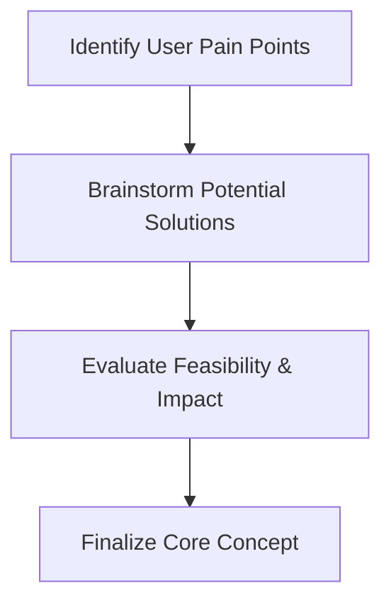

# [Project Name] by Xiao16

- **Team Members:** Lum Siew Feng, Lum Shu Ying
- **Problem Statement:** Stress & Workload Manager
- **Video Presentation:** [Unlisted Youtube Link]
- **Presentation Slides:** [Public Link]

---

## 1. Project Overview

### 1.1 Problem Statement
University students often have to manage multiple responsibilities, such as assignments, part-time jobs, social commitments, and personal errands. When these responsibilities accumulate, students may struggle to recognise how much they are carrying overall, especially when facing poor time management or unequal contributions from group members. This can increase academic stress and negatively affect their mental well-being, as highlighted by [Barbayannis et al. (2022)](https://pmc.ncbi.nlm.nih.gov/articles/PMC9169886/). Therefore, there is a need for a solution that helps students understand their overall workload and manage it before it becomes overwhelming.

### 1.2 Stakeholders
- **Primary Stakeholder – University Students:**
  University students are the main users who need to visualise and manage their overall workload across academic, work, social, physical, and personal responsibilities. The system will also allow them to upload assignment questions or relevant files to support task breakdown and planning.
- **Secondary Stakeholders – Project Managers & Other Users:**
  Project managers and other individuals who manage multiple tasks can use the system to visualise workload, distribute tasks, and plan their time more effectively.

### 1.3 Competitor Analysis

| Competitor | Feature List | Advantages | Disadvantages / Limitations |
| :--- | :--- | :--- | :--- |
| **Todoist** | • Task & project management • Subtasks • Priorities & labels • Due dates & reminders • Calendar & board views • Filters • Collaboration & task assignment • File attachments • AI task assistance | • Simple and easy to use • Strong task organisation • Suitable for personal and group tasks • Flexible views and integrations • Good cross-platform accessibility | • Primarily focused on task management • Does not focus on overall personal workload capacity • Limited burnout and recovery support • Not specialised for university assignments |
| **TickTick** | • Task & list management • Calendar views • Kanban & Timeline • Reminders • Pomodoro timer • Habit tracker • Eisenhower Matrix • Statistics • Collaboration & integrations | • All-in-one productivity tool • Strong calendar visualisation • Includes Pomodoro and habit tracking • Supports multiple task views • Suitable for personal, work, and study planning | • Primarily productivity-focused • Does not provide a unified life workload/capacity model as its core purpose • Focuses more on completing and scheduling tasks than deciding whether commitments should be reduced • Not specialised for academic workload analysis |
| **Zoho Projects** | • Project & task management • Subtasks & dependencies • Gantt charts • Kanban & calendar • Time tracking • File attachments • Team collaboration • Workload reports • Resource allocation • AI task assistance | • Strong project and team management • Detailed workload visualisation • Supports workload balancing and task reassignment • Strong collaboration and progress tracking • Suitable for complex projects | • Primarily designed for professional project management • Workload is mainly based on project tasks and business hours • Does not combine academic, work, social, and personal workload into one student-focused view • Recovery and personal well-being are not the primary focus |
| **Reclaim.ai** | • AI calendar planning • AI task scheduling • Focus time • Habits • Buffer/recovery time • Smart meeting scheduling • Auto-rescheduling • Calendar sync • Workload/time insights • AI scheduling assistant | • Strong AI-based scheduling • Automatically adapts to schedule changes • Protects focus and personal routine time • Identifies scheduling conflicts and overloaded days • Provides workload and time insights | • Primarily designed as an AI calendar and scheduling tool • Strong at deciding when work should be scheduled, but not specifically designed for university assignment analysis • Not specialised for group assignment workload fairness • Not specifically focused on analysing academic requirements from assignment documents |

### 1.4 Our Solution
Existing productivity and project management tools help users organise tasks, schedules, and team resources. However, they are not specifically designed to help university students understand their combined academic and personal workload. Our solution integrates assignment understanding, task distribution, personal workload visualisation, capacity awareness, and recovery recommendations to help students rebalance their commitments before they become overwhelmed.

### 1.5 Key Features
- 📊 **Workload Dashboard**
  - Visualise overall workload across: Academic, Part-time work, Social commitments, Personal errands, and Physical activities.
  - Display overall workload/capacity percentage.
  - Identify overloaded categories or periods.
- 📄 **Assignment & File Upload**
  - Upload assignment questions, briefs, rubrics, or other planning documents.
  - AI analyses the uploaded content.
  - Extract important requirements, deliverables, and deadlines.
- 🤖 **AI Task Breakdown**
  - Automatically convert large assignments into manageable tasks and subtasks.
  - Identify task dependencies and suggested completion order.
  - Allow users to edit generated tasks.
- 👥 **Group Task Distribution**
  - Create or join assignment groups.
  - Distribute tasks among group members.
  - Visualise each member's assigned workload.
  - Identify workload imbalance between members.
  - Suggest task redistribution.
- 📅 **Smart Workload Planning**
  - Combine assignments and other commitments into one workload view.
  - Show upcoming busy or overloaded periods.
  - Prioritise tasks based on deadlines and importance.
  - Suggest when tasks should be completed.
- ⚖️ **AI Load Balancer**
  - Detect when a student's workload exceeds their preferred capacity.
  - Recommend which low-priority tasks can be postponed or rescheduled.
  - Suggest redistributing group tasks where appropriate.
  - Help spread workload across less busy periods.
- 🧠 **Stress & Well-being Check-in**
  - Allow students to record their perceived stress or energy level.
  - Track changes over time.
  - Consider self-reported well-being when providing workload recommendations.
- 🌿 **Recovery Recommendations**
  - Detect prolonged periods of high workload.
  - Suggest recovery activities such as: Taking breaks, Sleeping, Physical activity, Social interaction, and Outdoor activities.
  - Encourage students to schedule recovery time.
- 🔔 **Smart Notifications**
  - Alert users about approaching deadlines.
  - Notify users when their workload becomes excessive.
  - Remind users to take breaks or schedule recovery.

### 1.6 References
- [Beyond Blue: How to deal with assignment & university anxiety](https://forums.beyondblue.org.au/t5/anxiety/how-to-deal-with-assignment-university-anxiety/td-p/622204)
- [Barbayannis, G. et al. (2022). Academic Stress and Mental Well-Being in College Students: Correlations, Affected Groups, and COVID-19. PMC9169886.](https://pmc.ncbi.nlm.nih.gov/articles/PMC9169886/)

---

## 2. Ideation and Process

### 2.1 Ideas We Considered

| Idea / Feature | Status | Why it was Dropped / Kept |
| :--- | :---: | :--- |
| **Workload Dashboard** | ✅ **Chosen** | Chosen because it directly addresses the core problem that students may not realise how much they are carrying. It provides an overall view of assignments, work, social commitments, deadlines, and available capacity. It also acts as the foundation for the AI planning and load-balancing features. |
| **Assignment & File Upload** | ✅ **Chosen** | Chosen because assignments are a major source of student workload, while uploaded files can provide additional context for AI processing. It allows students to keep assignment information and supporting materials together instead of manually entering everything. |
| **AI Task Breakdown** | ✅ **Chosen** | Chosen because large assignments can feel overwhelming when treated as one task. Breaking them into smaller steps makes the work easier to understand and gives the planning system smaller, more realistic units to schedule. |
| **Group Task Distribution** | ✅ **Chosen** | Chosen because group assignments create workload-management problems that individual task managers do not address. Dividing an assignment between members allows each student to see their actual responsibility rather than treating the entire group project as their own workload. |
| **Smart Workload Planning** | ✅ **Chosen** | Chosen because simply listing tasks does not solve workload problems. The system needs to consider deadlines, estimated duration, and existing commitments to create a realistic schedule and reduce periods where too many tasks accumulate. |
| **AI Load Balancer** | ✅ **Chosen** | Chosen because a student's workload can change after adding new tasks, missing deadlines, or receiving unexpected commitments. The AI can analyse the current workload and suggest how tasks should be rearranged to prevent overloaded periods. |
| **Speech-to-Text Task Input** | ✅ **Chosen** | Chosen because manually entering many tasks can be tedious. Speech-to-text provides a faster way to add commitments while maintaining the main workload-management workflow. |
| **Daily Check-in** | ❌ **Dropped** | Dropped for the current version because it requires users to repeatedly provide manual information about their condition. Although useful for stress tracking, it is not essential to the core workload-planning workflow and would increase the amount of data users need to maintain. |
| **Weekly Report** | ❌ **Dropped** | Dropped for the current version because it focuses on retrospective analysis rather than helping students immediately manage their workload. It would also require enough historical data before the reports become meaningful, so it can be considered for future development. |
| **Gamification – Virtual Pet** | ❌ **Dropped** | Dropped because the virtual pet mainly improves engagement rather than solving the student's workload problem. Building pet progression, interactions, and rewards would also consume development time that could instead be used for the core AI workload features. |
| **Gamification – Profile Decoration** | ❌ **Dropped** | Dropped because profile customisation has limited connection to workload management. It may make the application more enjoyable, but it does not help students understand, plan, or rebalance their workload. |
| **Gamification – Coins / Rewards** | ❌ **Dropped** | Dropped because a coin economy would introduce additional mechanics for earning and spending rewards without directly addressing workload overload. The project prioritises practical workload intervention over reward-based motivation. |
| **Mental Health Check** | ❌ **Dropped** | Dropped because it expands the project toward mental-health monitoring rather than focusing on workload management. It would also require careful handling of sensitive personal information and interpretation of self-reported mental states. |
| **Sleep-hour Detection from Phone Usage** | ❌ **Dropped** | Dropped because detecting sleeping patterns requires additional phone-usage data and introduces privacy and accuracy considerations. Sleep is relevant to wellbeing, but it is not necessary for the core workload-management solution. |
| **Burnout Risk Prediction** | ❌ **Dropped** | Dropped because reliable burnout prediction would require substantial personal and historical data and could produce misleading conclusions. The current project focuses on measurable workload and scheduling problems rather than attempting to make a broader wellbeing prediction. |
| **Stress Level Prediction** | ❌ **Dropped** | Dropped because predicting stress would require reliable stress-related data and a suitable prediction model. It also moves the project further into mental-health prediction, while the selected features already provide a way to reduce workload-related stress without predicting a user's psychological state. |
| **Mood Journal** | ❌ **Dropped** | Dropped because it introduces another manual wellbeing-tracking activity that is not required for workload planning. It could provide useful long-term insights, but it is lower priority than directly helping users organise their workload. |
| **Gratitude / Reflection Prompt** | ❌ **Dropped** | Dropped because reflection prompts are general wellbeing features and have a weaker connection to the project's main workload-management problem. |
| **Wellness Challenges** | ❌ **Dropped** | Dropped because challenges such as sleeping earlier or walking daily introduce a lifestyle-management component that is outside the main scope of academic workload management. |
| **Stress Trigger Analysis** | ❌ **Dropped** | Dropped because it requires sufficient historical stress and behavioural data to identify reliable patterns. The initial system instead focuses on analysing current workload and providing actionable planning recommendations. |
| **Personalized Weekly Advice** | ❌ **Dropped** | Dropped because it depends on the weekly reporting and stress-tracking features that were also removed from the current scope. |
| **Personalized Stress Recommendations** | ❌ **Dropped** | Dropped because recommendations such as breathing exercises, walking, or listening to music shift the system toward a general wellbeing application. The project instead prioritises reducing stress through better workload organisation. |
| **Micro-Break Planner** | ❌ **Dropped** | Dropped because break scheduling adds another planning dimension and increases the scope of the scheduling engine. The current priority is balancing academic and personal commitments rather than managing every aspect of a student's daily routine. |
| **Mood-Based Suggestions** | ❌ **Dropped** | Dropped because it requires mood input and introduces wellbeing-based decision-making. The selected system can already adjust workload through task, deadline, and schedule information without requiring mood classification. |
| **Sleep Tracking** | ❌ **Dropped** | Dropped because it requires additional personal data and does not directly contribute to the core workload-planning functionality. |
| **Energy-Based Scheduling** | ❌ **Dropped** | Dropped because scheduling according to energy levels requires users to provide or establish reliable energy patterns. For the current version, scheduling based on workload, available time, and deadlines is more practical and easier to implement within the project scope. |
| **Exam Preparation Planner** | ❌ **Dropped** | Dropped because it introduces a specialised study-planning system on top of the general workload planner. The current Smart Workload Planning feature provides a broader solution that can accommodate exam-related tasks without requiring a separate planning module. |
| **Smart Priority Engine** | 🔄 **Integrated** | Dropped as a separate feature because its functionality overlaps with Smart Workload Planning and AI Load Balancer. Priority can instead be incorporated into the existing planning and balancing logic without creating another independent system. |
| **“What Should I Do Now?” Button** | ❌ **Dropped** | Dropped because it overlaps with Smart Workload Planning. The existing planner can recommend suitable tasks based on deadlines and available time without requiring a separate standalone decision-support feature. |
| **Procrastination Pattern Detection** | ❌ **Dropped** | Dropped because it requires long-term behavioural data and increases the complexity of analysing user behaviour. The project focuses on preventing workload overload rather than diagnosing why a student delays tasks. |
| **Gentle Nudges** | ❌ **Dropped** | Dropped because notification-based behavioural intervention is secondary to the core workload-management functions. The project prioritises changing the workload itself rather than repeatedly reminding students to work. |
| **Personalized Wellbeing Recommendations** | ❌ **Dropped** | Dropped because this expands the system into lifestyle and mental-wellbeing recommendations. The current scope concentrates on reducing stress indirectly by helping students manage their workload. |
| **Pomodoro / Focus Timer** | ❌ **Dropped** | Dropped because many existing productivity applications already provide focus timers. Implementing one would not provide a strong differentiator for the project. |
| **AI Rescheduling** | 🔄 **Integrated** | Integrated into Smart Workload Planning / AI Load Balancer rather than developed as a separate feature. Rescheduling is already an important function of the selected AI features, so making it a separate module would duplicate functionality and increase scope unnecessarily. |
| **“What If I Accept?” AI Simulation** | ❌ **Dropped** | Dropped because its underlying functionality overlaps with workload analysis and AI Load Balancer. Instead of developing a separate conversational simulation, the impact of adding a new task can be reflected through the workload dashboard and balancing process. |
| **AI Planning / Chat Assistant** | ❌ **Dropped** | Dropped as a standalone conversational feature because it would require additional AI conversation handling while overlapping with the selected planning functions. The project can provide actionable AI recommendations without needing a full chatbot. |
| **Syllabus Import** | ❌ **Dropped** | Dropped because automatically extracting deadlines from syllabi introduces document parsing and extraction complexity. Assignment & File Upload provides a more focused file-based feature for the current version. |
| **Semester Planner** | ❌ **Dropped** | Dropped because managing an entire semester timetable introduces substantial scheduling complexity. The current system focuses on workload planning rather than becoming a complete academic calendar replacement. |
| **Workload Score** | 🔄 **Integrated** | Dropped as a standalone feature because workload information will be represented through the Workload Dashboard. A score can potentially be incorporated into the dashboard later without becoming a separate module. |
| **Workload Heatmap** | 🔄 **Integrated** | Dropped as a standalone feature because it is primarily a visualisation method rather than a separate workload-management function. The core concept can be incorporated into the Workload Dashboard if needed. |
| **Deadline Density Analysis** | 🔄 **Integrated** | Dropped as a standalone feature because it overlaps with Smart Workload Planning and AI Load Balancer, which already need to consider deadlines when determining workload. |
| **Overload Warning** | 🔄 **Integrated** | Dropped as a standalone feature because overload detection can be incorporated into the Workload Dashboard and AI Load Balancer rather than being developed as an independent feature. |
| **Recovery / Rescue Plan Mode** | 🔄 **Integrated** | Dropped because it introduces a separate emergency workflow for overwhelmed students. Although useful, the current AI Load Balancer is intended to address the underlying problem by rebalancing the workload. |
| **“I Am Overwhelmed” Panic Button** | ❌ **Dropped** | Dropped because it focuses on emotional crisis/triage rather than the project's primary workload-management workflow. It would also require designing a separate simplified interface and intervention process. |
| **Minimum Viable Day Planning** | ❌ **Dropped** | Dropped because it requires the system to determine which activities can safely be removed from a student's day. This overlaps with AI Load Balancing but introduces additional decision-making rules that are not essential to the MVP. |
| **Scope Creep Detector** | ❌ **Dropped** | Dropped because determining whether a student's estimated duration is unrealistic would require external benchmarks or historical data. The project instead allows AI Task Breakdown to create a more realistic understanding of the work required. |
| **Procrastination Recovery Plan** | ❌ **Dropped** | Dropped because it requires behavioural analysis and intervention beyond the current workload-management scope. |
| **Exam Season Mode** | ❌ **Dropped** | Dropped because it introduces a specialised application mode when the existing workload-planning system can already manage exam-related tasks. |
| **Failure Museum** | ❌ **Dropped** | Dropped because it changes the application from a personal workload-management tool into a social content platform. It would also require anonymous content management, moderation, and community participation, creating a large additional scope. |
| **Big Sibling AI** | ❌ **Dropped** | Dropped because it focuses on general life-administration problems such as calling landlords, cooking, or handling bills rather than student workload. Although it addresses executive dysfunction, it is too broad compared with the selected academic workload focus. |
| **Biometric Anti-Doomscroll Interface** | ❌ **Dropped** | Dropped because it requires access to phone sensors and potentially physiological or behavioural signals. It also focuses on controlling digital behaviour rather than managing academic workload, making it technically complex and outside the project's current scope. |
| **Parallel Play / Cozy Rooms** | ❌ **Dropped** | Dropped because it requires real-time social or audio functionality and depends on having enough users to create a meaningful community. This creates substantial infrastructure and moderation requirements unrelated to the core workload-management system. |
| **Perspective Engine** | ❌ **Dropped** | Dropped because it focuses on psychological techniques for managing catastrophising and future anxiety rather than directly managing workload. It would also require careful handling of sensitive emotional situations. |
| **Ephemeral “Scream into the Void”** | ❌ **Dropped** | Dropped because it introduces anonymous user-generated content, audio/text sharing, and moderation. These requirements are far beyond the scope of the selected workload-management features. |
| **Off-Track Career Mapper** | ❌ **Dropped** | Dropped because career exploration is a different problem from workload and academic stress management. Although career uncertainty can cause stress, solving it would significantly broaden the application's target problem. |
| **Body Doubling Audio Rooms** | ❌ **Dropped** | Dropped because real-time audio rooms introduce additional technical, privacy, and moderation requirements. The feature also focuses on social accountability rather than directly managing workload. |
| **Peer Support Groups** | ❌ **Dropped** | Dropped because anonymous support communities require moderation, safety mechanisms, and privacy considerations. These requirements are too extensive for the current project scope. |
| **Advisor / Counselor View** | ❌ **Dropped** | Dropped because it requires a separate user role, permission system, and consent-based data sharing. It also shifts the application toward an institutional platform rather than a student-focused MVP. |
| **Institutional Analytics** | ❌ **Dropped** | Dropped because it requires aggregating and anonymising student data and introduces additional privacy considerations. It is more suitable for a future university-level version. |
| **Calendar Integration** | ❌ **Dropped** | Dropped because integrating external calendars introduces authentication, synchronisation, and API-development requirements. The current system can manage workload through its own planning interface. |
| **LMS Integration** | ❌ **Dropped** | Dropped because integrations with Moodle, Canvas, Blackboard, Teams, or Google Classroom require different APIs, authentication, and institution-specific configurations. This is too broad for the current development scope. |
| **Wearable Integration** | ❌ **Dropped** | Dropped because integration with Fitbit, Apple Health, Google Fit, or Garmin requires external APIs and access to sensitive health-related information. It is unnecessary for the core workload-management solution. |
| **Automatic Assignment Extraction from Syllabus** | ❌ **Dropped** | Dropped because it requires reliable document parsing and deadline extraction across different syllabus formats. The selected Assignment & File Upload feature provides a simpler starting point. |
| **Healthy Productivity Points** | ❌ **Dropped** | Dropped because it returns to the gamification concept, which was intentionally removed. Rewarding productivity could also unintentionally encourage students to focus on completing more work rather than maintaining a healthy workload. |
| **Streaks** | ❌ **Dropped** | Dropped because streak mechanics can create pressure when users miss a day and may conflict with the project's goal of reducing guilt and workload-related stress. |
| **Badges** | ❌ **Dropped** | Dropped because badges provide engagement incentives but do not directly solve workload-management problems. Development effort is better spent on the AI planning and balancing features. |
| **Smart Supportive Notifications** | ❌ **Dropped** | Dropped as a major standalone feature because notifications are secondary to the main workload-management workflow. Basic reminders may still be useful, but a complex notification engine is not required for the MVP. |
| **Empathetic AI Rescheduling / “Guilt-Free Snooze”** | 🔄 **Integrated** | Dropped as a separate named feature because the concept is already covered by the AI Load Balancer. The principle of allowing users to recover from missed tasks without simply marking them as failures can be incorporated into the selected balancing workflow. |
| **Stress-Aware Calendar** | ❌ **Dropped** | Dropped because it depends on stress tracking and prediction, which were removed from the current scope. The selected system instead focuses on workload-aware scheduling. |
| **Academic Shock Absorber** | 💡 **Retained as Philosophy** | Concept retained as the overall design philosophy rather than a standalone feature. The idea of dynamically helping students recover when their workload changes is represented by Smart Workload Planning and AI Load Balancer, so it does not need to be implemented as a separate module. |
| **Guilt-Free Academic Planner** | 💡 **Retained as Philosophy** | Concept retained as the product direction rather than a separate feature. The project aims to avoid simply showing overdue tasks and instead help students realistically reorganise their workload. This philosophy is implemented through the selected planning and balancing features. |
| **Capacity-Aware Planning** | ❌ **Dropped** | Dropped as a separate feature because measuring a student's true physical or mental capacity would require stress, sleep, energy, or biometric information. The current version uses measurable workload and scheduling information instead. |
| **Energy-Aware Auto-Scheduling** | ❌ **Dropped** | Dropped because it requires personal energy-pattern information and potentially wellbeing data. It also adds another variable to the scheduling algorithm when deadline, duration, and availability are already sufficient for the current MVP. |
| **Stress-Aware Scheduling** | ❌ **Dropped** | Dropped because it depends on the stress-tracking and stress-prediction features that were removed. |
| **Burnout-Aware Scheduling** | ❌ **Dropped** | Dropped because it depends on burnout-risk prediction, which was also removed due to data, reliability, and scope concerns. |
| **Study Plan Generator** | ❌ **Dropped** | Dropped because it overlaps with Smart Workload Planning and would create a separate academic-planning workflow. |
| **AI Priority Recommendation** | 🔄 **Integrated** | Dropped as a standalone feature because priority handling can be incorporated into Smart Workload Planning and AI Load Balancer. |
| **Task Progress Tracking** | 🔄 **Supporting** | Included as part of Assignment & File Upload / Workload Dashboard rather than treated as a separate major feature. Tracking progress is useful for understanding how much work remains, but it does not need to be a separate module. |
| **Course / Subject Management** | 🔄 **Supporting** | Included as supporting functionality rather than a major feature. Categorising assignments by course helps organise the dashboard and workload information, but it is not one of the project's primary differentiating features. |
| **Task Priority** | 🔄 **Supporting** | Included as supporting functionality within Smart Workload Planning. Priority helps the AI decide which tasks should be scheduled first, but it is not intended to be a separate standalone feature. |
| **Estimated Task Duration** | 🔄 **Supporting** | Included as supporting functionality within Smart Workload Planning. Duration is necessary for determining whether the user's available time is sufficient and for producing a realistic schedule. |
| **Deadline Management** | 🔄 **Supporting** | Included as supporting functionality within Assignment & File Upload and Smart Workload Planning. Deadlines are fundamental inputs for determining urgency and preventing last-minute workload accumulation. |

### 2.2 Ideation Diagram

> *(Replace or update the diagram above with your team's ideation workflow/mindmap)*

### 2.3 Mentor Consultation

| Mentor | Date Time | Feedback | Changes |
| :--- | :--- | :--- | :--- |
| **Teng Wei Herr** | 4 Sep 2026, 16:25 | • **Focus on Depth Rather Than Breadth:** Focus on one specific aspect of student stress and explore the problem more deeply instead of covering too many areas. • **Conduct More Research on Stress:** Conduct further research on student stress to better understand existing methods of managing it. • **Enhance Existing Solutions:** A completely new idea is not necessary. Existing systems can be studied and enhanced by identifying their limitations and adding improvements that provide greater value to users. | |
| **Kueh Pang Teng** | 5 Sep 2026, 22:15 | • **Pitch Structure & Presentation Strategy:** &nbsp;&nbsp;- Follow rubric closely; emphasize sections with higher scoring weights. &nbsp;&nbsp;- Clearly present problem statement, target users/difficulties, solution, and tech stack. &nbsp;&nbsp;- Cover business/market growth and user acquisition if required. &nbsp;&nbsp;- Create a memorable impression with unique elements. • **Market Research & Competitor Analysis:** &nbsp;&nbsp;- Study existing applications; compare features, strengths, and weaknesses. &nbsp;&nbsp;- Clearly demonstrate what makes the solution distinct and why users would choose it. &nbsp;&nbsp;- Review prior hackathons to learn how similar problems were approached. • **Ideation & Feature Development:** &nbsp;&nbsp;- Ensure features solve real, verified problems rather than bloating functionality. &nbsp;&nbsp;- Emphasize team-driven ideation; use AI as a supporting tool rather than relying on AI prompts for core concepts. &nbsp;&nbsp;- Gamification must be purposeful and tied to real problem-solving rather than trivial points/badges. • **Evidence & Validation:** &nbsp;&nbsp;- Back feature claims with research papers, surveys, or market data. &nbsp;&nbsp;- Maintain explicit linkages between features, user needs, and the main problem statement. • **Hackathon Strategy:** &nbsp;&nbsp;- Prioritize idea refinement and unique selling points. &nbsp;&nbsp;- Concentrate development efforts on high-scoring, high-value MVP features. &nbsp;&nbsp;- Ensure end-to-end consistency across problem, features, tech, prototype, and pitch. | |
| **Looi Wei En** | 6 Sep 2026, 20:00 | • **Ideation & Problem Scoping:** &nbsp;&nbsp;- List all qualifying ideas and clearly scope included vs. excluded features. &nbsp;&nbsp;- Provide brief, data-backed problem validation without spending excessive time. &nbsp;&nbsp;- Keep problem statements precise; clarify vague terms (e.g., exact inputs/outputs of "AI analysis"). &nbsp;&nbsp;- Maintain strict feature alignment with the central workload/stress problem. • **Feature Selection & Differentiation:** &nbsp;&nbsp;- Unifying existing fragmented tools into an all-in-one workflow serves as a strong differentiator. &nbsp;&nbsp;- Evaluate competitor apps; refine existing concepts instead of chasing novelty for its own sake. &nbsp;&nbsp;- Demote non-essential utilities (e.g., app blockers) to secondary priority. &nbsp;&nbsp;- Specify mechanics in detail (e.g., burnout metrics, task difficulty calculation). &nbsp;&nbsp;- Focus maximum development resources on the core differentiator. • **Execution & Technical Implementation:** &nbsp;&nbsp;- Prioritize a working concept prototype over a complete application. &nbsp;&nbsp;- Filter features by technical feasibility and implementation timeline. • **Pitching & Presentation:** &nbsp;&nbsp;- Craft a crisp 5-minute pitch highlighting key project value. &nbsp;&nbsp;- Scope the demo prototype to features that can be clearly showcased within the time limit. • **Handling Mentor Feedback:** &nbsp;&nbsp;- Critically evaluate advice across mentors; filter recommendations while preserving core project vision. | |

---

## 3. Design Prototype
- **Prototype Link / Figma:** [Figma Link or UI Prototype Link]
- **Screenshots / Visual Walkthrough:**
  - *Add your UI mockups or screenshot placeholders here*

---

## 4. What Makes It Different

### 4.1 Unique Value Proposition (UVP)
Unlike traditional productivity tools that merely schedule tasks or optimize project hours, our solution treats workload as a **holistic personal capacity and decision-making problem**. By combining academic document understanding (extracting workload directly from assignment files), whole-life commitment tracking, fairness-driven group workload balancing, and proactive load-rebalancing with recovery protection, we empower students to prevent burnout before it happens rather than simply squeezing more tasks into an overcrowded calendar.

### 4.2 Novel Features & Differentiators

| # | Novel Feature | What It Does | What is Original / The Twist |
| :-: | :--- | :--- | :--- |
| **1** | **Student Workload Capacity** | Shows how much workload a student is carrying compared with their personal maximum capacity. | Existing tools mainly organise tasks, schedules, or project hours. The twist is treating workload as a **personal capacity problem**, not just a task-count or calendar problem. |
| **2** | **Before/After Workload Preview** | Before adding a new task or commitment, the system shows how it changes the student's workload. | Instead of saying *"You have a new task"*, it answers *"What will happen to my workload if I accept this?"* This directly addresses the problem of students not knowing how much they are carrying. |
| **3** | **"Should I Say Yes?" AI Simulator** | Student enters a potential commitment, and AI simulates its impact before they accept it. | The system helps users make a decision rather than simply scheduling the commitment. It can recommend **Accept / Modify / Decline** with clear rationales. |
| **4** | **Assignment-to-Workload Pipeline** | Student uploads an assignment brief/question → AI identifies requirements → breaks it into tasks → estimates workload → adds it to the workload dashboard. | The twist is connecting **academic document understanding directly to workload management**, eliminating the friction of manually creating and estimating every single task. |
| **5** | **Academic Group Workload Balancer** | Shows each group member's assigned workload and recommends redistribution when one member is carrying significantly more work. | While tools like [Zoho Projects](https://help.zoho.com/portal/en/kb/projects/reports/workload-report/articles/workload-report) support enterprise team workload allocation, our twist is applying it specifically to **university group assignments**, balancing academic requirements and individual capacity fairness. |
| **6** | **Whole-Life Workload Visualisation** | Combines assignments, part-time work, social activities, and personal commitments into one unified workload picture. | Instead of managing siloed "projects", the system looks at the **student's entire life load**, which directly addresses the true root cause of student burnout. |
| **7** | **AI Workload Rebalancer** | When workload becomes excessive, AI suggests moving, postponing, redistributing, or reducing tasks. | While calendar optimizers like [Reclaim.ai](https://help.reclaim.ai/en/articles/6207587-how-reclaim-manages-your-schedule-automatically) focus on where to fit tasks into a calendar, our AI focuses on **what should change or be reduced** to keep workload sustainable. |
| **8** | **Recovery-Aware Planning** | When workload remains high, the system protects or recommends sleep, breaks, exercise, downtime, or social recovery. | The objective shifts from *"fit more work into the schedule"* to *"maintain a sustainable workload"*. Unlike general buffer times in tools like [Reclaim.ai](https://help.reclaim.ai/en/articles/14846468-reclaim-ai-2-0-overview), our recovery recommendations are tied specifically to the student's **overall workload pressure and stress state**. |
| **9** | **Stress Source Analysis** | Weekly reports identify the proportion and source of user stress/load (e.g., Academic 60%, Work 25%, Social 15%). | Instead of only showing completed task counts or time-spent statistics, the system answers *"What is driving my current overload?"* |
| **10** | **Workload-Aware Task Input** | Speech-to-text lets students quickly add a task, then immediately shows its instant effect on their workload. | Voice input is combined with **instant workload impact prediction**, keeping quick capture aligned with capacity awareness. |
| **11** | **Workload-Aware AI Chat** | Students can ask contextual questions like *"Can I accept another work shift?"* or *"Can I finish this assignment by Friday?"* | The chatbot is not a generic assistant; it is grounded in the user's **live workload data, deadlines, personal capacity, and existing commitments**. |
| **12** | **Gamified Sustainable Productivity** | Students earn coins/rewards for completing tasks, maintaining healthy routines, and managing workload responsibly. | Rather than rewarding unsustainable overwork (completing as many tasks as possible), the system **rewards healthy, balanced workload management**. |

---

## 5. Technical Architecture & Feasibility

### 5.1 Tech Stack

| Component | Technology | Purpose / Why Chosen |
| :--- | :--- | :--- |
| **Mobile Frontend** | **Flutter + Dart** | Develop the Android mobile application from a single codebase. Flutter is suitable for the mobile-first scope and supports rapid development of dashboards, forms, task management, and interactive interfaces. |
| **UI / Design** | **Flutter Material 3** | Provides reusable mobile UI components for dashboards, cards, forms, navigation, dialogs, and interactive workload visualisations. |
| **State Management** | **Flutter State Management** *(e.g., Riverpod)* | Manages application state such as tasks, workload information, group activities, authentication status, and real-time updates between screens. |
| **Local Cache** | **Flutter Local Storage** *(e.g., SQLite / SharedPreferences)* | Stores lightweight local data and temporary application state to reduce unnecessary network requests and improve the responsiveness of the mobile application. |
| **Backend / API** | **Supabase Edge Functions** | Provides server-side application logic and HTTP API endpoints without requiring a separate backend server. Used to process requests, enforce business rules, and coordinate application services. |
| **API Security** | **HTTPS + Rate Limiting** | Secures communication between the Flutter application and backend services while limiting excessive API requests and reducing potential API abuse. |
| **Authentication & Authorisation** | **Supabase Auth** | Handles user registration, login, session management, and authenticated access to application resources. |
| **Database** | **Supabase PostgreSQL** | Stores structured application data such as users, assignments, tasks, schedules, workload records, group tasks, check-ins, stress reports, and gamification data. PostgreSQL is suitable for relational relationships and complex queries. |
| **File Storage** | **Supabase Storage** | Stores assignment-related files and other user-uploaded resources separately from the relational database. |
| **Real-time Data** | **Supabase Realtime** | Provides real-time updates when database records change, allowing workload, task, and group collaboration changes to be reflected in the mobile application without continuous polling. |
| **AI Orchestration** | **Supabase Edge Functions + LLM API** | Edge Functions act as the application layer for communicating with the LLM. This keeps AI API credentials away from the mobile application and allows prompts, validation, and business rules to be controlled server-side. |
| **AI / Recommendation** | **LLM API** *(e.g., Google Gemini / OpenAI)* | Supports AI-based task breakdown, workload planning, commitment analysis, and personalised workload-management recommendations. |
| **Speech-to-Text** | **Speech-to-Text API** | Converts spoken task descriptions into text so students can create tasks through voice input. The request can be routed through the AI orchestration layer where appropriate. |
| **Charts / Visualisation** | **Flutter Charting Library** *(e.g., fl_chart)* | Visualises workload distribution, weekly stress trends, task progress, and overload reports. |
| **Notifications** | **Device / Local Notifications** | Triggers reminders and alerts directly on the student's device for deadlines, planned tasks, and workload-related events. For a prototype where notifications are primarily device-triggered, a separate FCM backend is not necessarily required. |
| **Hosting / Backend Infrastructure** | **Supabase Cloud** | Hosts the PostgreSQL database, authentication, storage, real-time services, and Edge Functions, reducing the need to maintain separate backend infrastructure. |
| **Version Control** | **Git + GitHub** | Provides source-code version control, backup, branching, and collaboration throughout development. |

### 5.2 Architectural Diagram

### 5.3 Build Plan and Scope

Approximately **5 hours per day** will be allocated to the project during the three-week development phase (~105 hours total). The allocated time will cover system implementation, feature integration, debugging, and refinement, with the final three days primarily dedicated to rigorous system testing and final polish.

| Week | Day | Target Output / Milestone |
| :--- | :--- | :--- |
| **Week 1: Setup, Voice Input & Assignment Breakdown** | **Day 1** | Set up the Flutter project and Supabase database. Prepare the main project structure and create the basic tables needed to store assignments, tasks, files, groups, and workload information. |
| | **Day 2** | Start working on **Speech-to-Text Task Input**. Create the task input screen, add voice input, and convert what the student says into text that can be used as a task. |
| | **Day 3** | Improve the speech-to-text feature so the system can identify useful task information such as task name, deadline, and estimated time. Allow students to check and edit the information before saving it. |
| | **Day 4** | Start the **Assignment & File Upload** feature. Create the assignment form and allow students to enter assignment details and attach supporting files. |
| | **Day 5** | Complete the file upload process. Allow students to view, replace, and remove uploaded files, and make sure each file is correctly linked to its assignment. |
| | **Day 6** | Start the **AI Task Breakdown** feature. Send assignment information to the AI and generate smaller tasks that a student can work on step by step. |
| | **Day 7** | Improve the AI-generated breakdown. Let students review, edit, or remove suggested tasks before saving them. Connect the breakdown with the original assignment and test the complete assignment-to-task process. |
| **Week 2: Group Balancer, Planning & AI Load Balancer** | **Day 8** | Start **Group Task Distribution**. Allow students to create a group assignment, add group members, and divide the assignment into different responsibilities. |
| | **Day 9** | Complete group task distribution. Allow responsibilities to be changed or reassigned and calculate which tasks belong to the current student. |
| | **Day 10** | Start **Smart Workload Planning**. Gather information from the student's tasks, deadlines, and estimated durations, then work out how much time is available for completing them. |
| | **Day 11** | Develop the workload scheduling logic. Try to arrange tasks across available days while considering deadlines, task duration, and the amount of work already planned. |
| | **Day 12** | Create the workload planning screen. Let students view the suggested schedule and make changes when the plan does not suit them. Save the final plan to the database. |
| | **Day 13** | Start the **AI Load Balancer**. Use the student's current workload to identify periods where too many tasks are concentrated and generate suggestions for spreading the work out. |
| | **Day 14** | Connect the AI Load Balancer with the Smart Workload Planning feature. Allow students to review the suggested changes and update their workload plan based on the recommendations. |
| **Week 3: Dashboard, Integration & End-to-End Testing** | **Day 15** | Start building the **Workload Dashboard**. Bring together information from assignments, individual tasks, group responsibilities, and planned tasks so students can see their overall workload in one place. |
| | **Day 16** | Improve the dashboard to clearly show upcoming deadlines, task distribution, and periods with heavier workloads. Make sure the dashboard reflects the latest information from the other features. |
| | **Day 17** | Connect all seven features together and test the main user flow from adding a task or assignment through task breakdown, group distribution, planning, and workload balancing until the result appears on the dashboard. |
| | **Day 18** | Clean up the system and fix remaining development issues. Improve the interface, handle common errors, and make sure all seven chosen features are working together. Prepare the final version for testing. |
| | **Day 19** | **Testing Phase 1:** Test Speech-to-Text, Assignment & File Upload, and AI Task Breakdown. Check whether information is captured, saved, and processed correctly. Record and fix important problems. |
| | **Day 20** | **Testing Phase 2:** Test Group Task Distribution, Smart Workload Planning, and AI Load Balancer using different workload situations. Check whether tasks are distributed and scheduled correctly. |
| | **Day 21** | **Final Testing & Polish:** Test the complete system from beginning to end. Check the Workload Dashboard, repeat important test cases after fixes, identify remaining issues, and make the final corrections. |

---